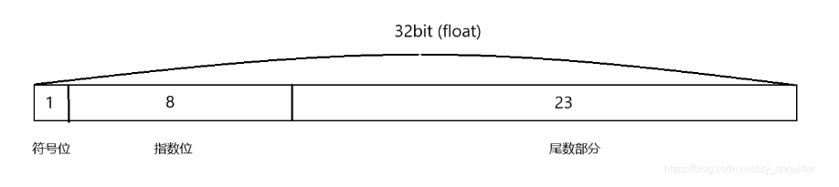

# 什么是定点数
 了解定点数之前，先了解一下浮点数Float(参考网站 https://blog.csdn.net/jiaoyangwm/article/details/129296459)

eg. 1.5f二进制表示

0 01111111 10000000000000000000000


## 生成Sin 查表数据

```C#
static void CalsSinLut()
    {
        int FRACTIONAL_PLACES = 16;
        long PI = (long)((Fix64)Mathf.PI);
        long PI_OVER_2 = (long)((Fix64)Mathf.PI);
        var LUT_SIZE = (int)(PI_OVER_2 >> FRACTIONAL_PLACES);
        Debug.Log(Mathf.Sin( Mathf.PI/2f));
        List<long> tlut = new List<long>(1608);
        for (float i = 0; i < LUT_SIZE; i++)
        {
            long v = (long)((Mathf.Sin( Mathf.PI*0.5f*i/LUT_SIZE)*(65536L)));
            tlut.Add(v);
        }
        // 将结果保存到文件
        string filePath = "FixSin64txt";
        int len = 7;
        using (StreamWriter writer = new StreamWriter(filePath))
        {
            writer.WriteLine("partial struct Fix64 {");
            foreach (long value in tlut)
            {
                var has = value.ToString("X");
                writer.Write($"    0x{has}L, ");
                if (--len< 0)
                {
                    writer.Write('\n');
                    len = 7;
                }
            }
            writer.WriteLine("}");
        }

        Console.WriteLine($"Data shifted and saved to {filePath}");
    }
接下来我们要把几个六边形拼在一起。

在里面平顶方向，相邻六边形中心之间的水平距离为horiz = 3/4 * width = 3/2 * size. 垂直距离为vert = height = sqrt(3) * size.

在里面尖顶方向，相邻六边形中心之间的水平距离为horiz = width = sqrt(3) * size. 垂直距离为vert == 3/4 * height == 3/2 * size.

一些游戏使用像素艺术来绘制与正多边形不匹配的六边形，这些公式必须稍作调整。有关详细信息，请参阅实施指南。

https://github.com/asik/FixedMath.Net.git