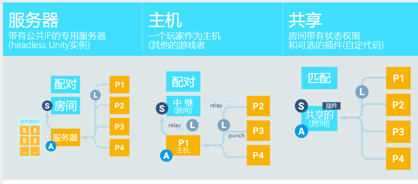

 [官网](https://dashboard.photonengine.com/zh-cn)

## 注册photonengine账号

## 创建App  


+ Realtime： Photon Realtime 是 Photon 提供的最基本的多人游戏服务。它允许开发人员快速轻松地创建实时多人游戏，提供了可靠的基础设施来处理玩家之间的连接、房间管理、同步游戏状态等功能。

+ Chat： Photon Chat 是一个实时聊天解决方案，允许开发人员为他们的游戏添加聊天功能。它提供了一种可扩展的方式来处理聊天消息的传递、管理用户的频道、历史消息等。

+ Voice： Photon Voice 是用于实时语音聊天的解决方案。它允许玩家在游戏中进行语音通信，提供了可靠的语音传输、音频编解码和回声消除功能。

+ PUN (Photon Unity Networking)： Photon PUN 是专为 Unity 开发者设计的高级网络解决方案。它是建立在 Photon Realtime 之上的，提供了易于使用的 Unity API，使开发人员能够在 Unity 中快速构建多人游戏。

+ Bolt 是 Photon 的另一个产品，它是一种高级的网络引擎，专为实时、多人游戏开发而设计。与Photon PUN不同，Bolt提供了更多的自定义性和灵活性，允许开发人员更深入地控制游戏的网络部分。

+ <font color=Red>Fusion 是 Unity 的全新高性能状态同步网络库。Fusion 在构建时考虑到了简单性，可以自然地集成到常见的 Unity 工作流程中，同时还提供开箱即用的数据压缩、客户端预测和滞后补偿等高级功能。</font>

## Fusion
### Host Mode Basics

### Shared Mode

### Server Mod

### 实例 Animancer 

PlayerLocomotionState.cs
```c#
//移动状态
public class PlayerLocomotionState : PlayerStateBehaviour
	{
		[SerializeField]
		private LinearMixerTransition _moveMixer;

		protected override void OnEnterStateRender()
		{
			Animancer.Play(_moveMixer);

			// Update the animation time based on the state time
			_moveMixer.State.Time = Machine.StateTime;
		}

		protected override void OnRender()
		{
			_moveMixer.State.Parameter = Controller.InterpolatedSpeed;
		}
	}
    ```
Player_AnimancerFSM.cs
```c#
public class Player_AnimancerFSM : NetworkBehaviour, IStateMachineOwner
	{
		// PRIVATE MEMBERS

		private CharacterController _controller;
		private PlayerBehaviourMachine _fullBodyMachine;

		// NetworkBehaviour接口调用
		public override void FixedUpdateNetwork()
		{
			if (IsProxy == true)
				return;

			if (_controller.HasJumped == true)
			{
                //状态机切换状态
				_fullBodyMachine.TryActivateState<PlayerJumpState>();
			}
		}

		// IStateMachineOwner接口调用
		void IStateMachineOwner.CollectStateMachines(List<IStateMachine> stateMachines)
		{
            //获得所有的的状态
			var states = GetComponentsInChildren<PlayerStateBehaviour>(true);
			var animancer = GetComponentInChildren<AnimancerComponent>(true);
            //创建状态机
			_fullBodyMachine = new PlayerBehaviourMachine("Full Body", _controller, animancer, states);
			stateMachines.Add(_fullBodyMachine);
		}
 
		protected void Awake()
		{
			_controller = GetComponentInChildren<CharacterController>();
		}
	}
```

# 本地服务器Photon Server





## 下载 & 运行deploy\bin_Win64\PhotonSocketServer.exe
